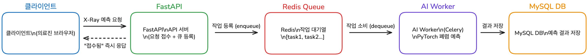

# 9일차 - 동시성 문제 해결을 위한 Event-Driven Architecture 설계

## 1. 배경 및 문제 정의

### 왜 동시성 문제가 발생하는가?

AI Health Web 프로젝트에서 사용자가 흉부 X-Ray 이미지를 업로드하고 폐렴 예측을 요청할 때, 다음과 같은 상황이 발생할 수 있다.

- 여러 의료진이 **동시에** AI 폐렴 예측 요청을 보냄
- AI 모델 추론은 **CPU/GPU 집약적 작업**으로 처리 시간이 길어짐
- FastAPI는 요청을 받는 즉시 AI 추론을 실행하면 **서버 과부하** 발생
- 응답 지연 → 타임아웃 → 서비스 장애로 이어짐

### 해결 방향

> **FastAPI(API 서버)** 와 **AI Worker(추론 서버)** 의 역할을 분리하고,  
> **Redis** 를 메시지 큐로 활용하여 작업을 비동기로 처리한다.

---

## 2. Event-Driven Architecture (EDA) 개념

### 핵심 개념

| 용어 | 설명 |
|------|------|
| **Producer** | 이벤트(작업)를 생성하여 큐에 넣는 주체 → FastAPI |
| **Queue** | 작업을 순서대로 저장하는 대기열 → Redis Stream / List |
| **Consumer** | 큐에서 작업을 꺼내 처리하는 주체 → AI Worker |
| **Event** | 시스템 간에 전달되는 메시지 (예: "X-Ray 예측 요청") |

### 기존 방식 vs EDA 방식

```
[기존 방식 - 동기]
사용자 → FastAPI → AI 추론 (5~10초) → 응답
         ↑ 동시 요청 10개 오면 서버 마비

[EDA 방식 - 비동기]
사용자 → FastAPI → Redis Queue → AI Worker → DB 저장
         ↑ 즉시 "접수됨" 응답     ↑ 순차 처리
```

---

## 3. 기술 스택 선택

### FastAPI + Redis + Celery

| 기술 | 역할 |
|------|------|
| **FastAPI** | REST API 서버, 요청 접수 및 작업 큐 등록 |
| **Redis** | 메시지 브로커 (작업 대기열 관리) |
| **Celery** | 분산 작업 큐 프레임워크, AI Worker 실행 |
| **AI Worker** | PyTorch 모델 로드 및 폐렴 예측 실행 |

### Redis를 선택한 이유

- **인메모리 데이터 저장소** → 빠른 읽기/쓰기 속도
- **List/Stream 자료구조** → 작업 큐 구현에 적합
- **Pub/Sub 지원** → 실시간 이벤트 처리 가능
- **Celery의 기본 브로커** → 통합이 쉬움

---

## 4. 아키텍처 설계

### 전체 흐름도

```
┌─────────────┐     HTTP 요청      ┌─────────────────┐
│   클라이언트   │ ──────────────→ │    FastAPI       │
│ (의료진 브라우저)│ ←────────────── │  (API 서버)      │
└─────────────┘   "작업 접수됨"    └────────┬────────┘
                                           │
                                    작업 등록 (enqueue)
                                           │
                                           ▼
                                  ┌─────────────────┐
                                  │      Redis       │
                                  │   (작업 대기열)   │
                                  │  [task1, task2,  │
                                  │   task3, ...]    │
                                  └────────┬────────┘
                                           │
                                    작업 소비 (dequeue)
                                           │
                                           ▼
                                  ┌─────────────────┐
                                  │   AI Worker     │
                                  │  (Celery Task)  │
                                  │                 │
                                  │ 1. X-Ray 이미지  │
                                  │    로드          │
                                  │ 2. PyTorch 추론  │
                                  │ 3. 결과 저장     │
                                  └────────┬────────┘
                                           │
                                           ▼
                                  ┌─────────────────┐
                                  │    MySQL DB      │
                                  │ (예측 결과 저장)  │
                                  └─────────────────┘
```

### 컴포넌트별 역할 분리

#### FastAPI (API 서버)
- 사용자 인증 및 권한 확인
- 요청 유효성 검사
- **Redis에 AI 작업 등록** (실제 추론은 하지 않음)
- 작업 ID 반환 → 클라이언트는 폴링으로 결과 확인

#### Redis (메시지 브로커)
- AI 추론 작업을 큐에 저장
- Worker가 처리할 수 있을 때까지 대기열 유지
- 작업 상태 관리 (대기중 / 처리중 / 완료)

#### AI Worker (Celery)
- Redis 큐에서 작업을 하나씩 꺼냄
- PyTorch 모델로 폐렴 예측 수행
- 결과를 MySQL에 저장
- 동시에 처리할 Worker 수 조절 가능

---

## 5. 코드 구조 예시

### 프로젝트 구조

```
proj_fastapi/
├── app/
│   ├── apis/
│   │   └── prediction_router.py   # AI 예측 요청 API
│   ├── tasks/
│   │   └── prediction_task.py     # Celery Task 정의
│   └── core/
│       └── celery_app.py          # Celery 설정
├── worker/
│   ├── model.py                   # PyTorch 모델 로드 및 추론
│   └── models/
│       └── model.pth              # 학습된 모델 파일
└── docker-compose.yml             # Redis + Worker 컨테이너 포함
```

### FastAPI - 작업 등록 (예시)

```python
# app/apis/prediction_router.py
from fastapi import APIRouter
from app.tasks.prediction_task import run_prediction

router = APIRouter(prefix="/api/v1/predictions", tags=["Prediction"])

@router.post("/{record_id}")
async def request_prediction(record_id: int):
    # Celery로 비동기 작업 등록
    task = run_prediction.delay(record_id)
    return {"task_id": task.id, "status": "queued"}

@router.get("/{task_id}/status")
async def get_prediction_status(task_id: str):
    # 작업 상태 조회
    from app.core.celery_app import celery_app
    result = celery_app.AsyncResult(task_id)
    return {"task_id": task_id, "status": result.status}
```

### Celery Task 정의 (예시)

```python
# app/tasks/prediction_task.py
from app.core.celery_app import celery_app
from worker.model import predict_pneumonia

@celery_app.task
def run_prediction(record_id: int):
    # 1. DB에서 진료기록 및 X-Ray 이미지 경로 조회
    # 2. AI 모델로 폐렴 예측
    result = predict_pneumonia(image_path)
    # 3. 결과 DB 저장
    return result
```

### Celery 설정 (예시)

```python
# app/core/celery_app.py
from celery import Celery

celery_app = Celery(
    "ai_health",
    broker="redis://redis:6379/0",   # Redis를 브로커로 사용
    backend="redis://redis:6379/1",  # 결과 저장도 Redis 활용
)
```

---

## 6. docker-compose.yml 확장 (Redis + Worker 추가)

```yaml
services:
  fastapi:
    build: .
    ports:
      - "8000:8000"
    depends_on:
      - mysql
      - redis

  redis:
    image: redis:7-alpine
    ports:
      - "6379:6379"

  ai-worker:
    build: .
    command: celery -A app.core.celery_app worker --loglevel=info
    depends_on:
      - redis
    volumes:
      - .:/app

  mysql:
    image: mysql:8.0
    # ... 기존 설정 유지
```

---

## 7. 동시성 문제 해결 효과

| 상황 | 기존 방식 | EDA 방식 |
|------|-----------|----------|
| 동시 요청 10개 | 서버 과부하, 타임아웃 | 큐에 쌓아 순차 처리 |
| AI 추론 시간 | 요청자가 대기 (5~10초) | 즉시 "접수됨" 응답 |
| 서버 확장 | FastAPI 서버 증설 필요 | Worker 수만 늘리면 됨 |
| 장애 대응 | 요청 유실 | 큐에 보관 → 재처리 가능 |

---

## 8. 아키텍처 도식 (Excalidraw)

> 아래 이미지는 Excalidraw로 작성한 EDA 아키텍처 도식입니다.



---

## 참고 자료

- [Redis + FastAPI Streams Event Processing](https://oneuptime.com/blog/post/2026-03-31-redis-fastapi-streams-event-processing/view)
- [FastAPI + Celery로 AI Task 비동기 처리하기](https://velog.io/@nickygod/FastAPI-Celery로-AI-Task-비동기-처리하기)
- [Mastering Background Job Queues with Celery, Redis and FastAPI](https://python.plainenglish.io/mastering-background-job-queues-with-celery-redis-and-fastapi-9eabb97c38af)
